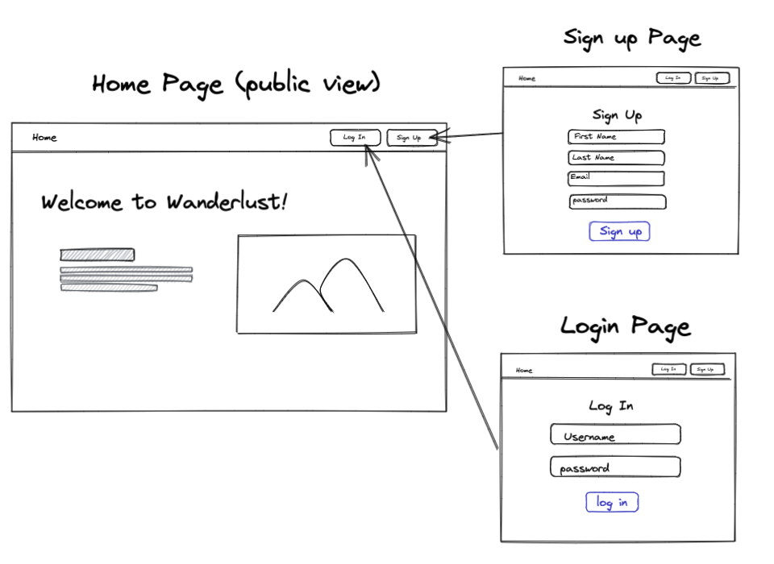
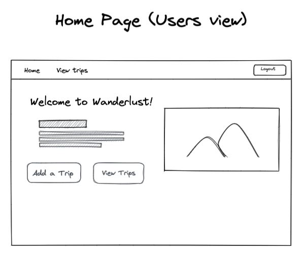

# Customer Graphical Human Interface

### Home page (public view):
- The home page (public view) will be the first page visitors arrive to on the website.
- Viewers will see a description of our app features.
- Navigation bar: home, login, and sign up button.

Buttons:
- Sign up/login: redirect to the signup/login page.

___________________________________________________________________
### Home page (users view):

- Navigation bar: home, view trips, logout

Buttons:
- Add a trip: Trip modal form with "add a trip" button and redirects to trip list page
- View trips: redirects to trip list page

________________________________________________________________
### Trip List page:

This page will have the users list of trips in block format.

Buttons:
- "+" : viewers modal form to add viewers emails
    - this will appear in their own trips list
- Trip title: redirects to specific trip details page

________________________________________________________________
### Trip details page:

This page will say "Trip to {trip title}", the dates, and notes.

Buttons:
- Update trip: Can update destination, start/end date, image url
- Delete trip: Alert window pops up at the top for confirmation
- Add/delete flight info: add/delete flight depart/return date, time, flight number, and airline
- Add/delete accommodations: add/delete accommodation name, address, reservation number, check in/out date and time
- Add activity: add new activity name, date, place and notes
    - Activity will be ordered by date
- Edit/Delete: edit/delete activity in an edit activity modal

- Checklist: add items and items will populate below with the option to press "x" to remove items

